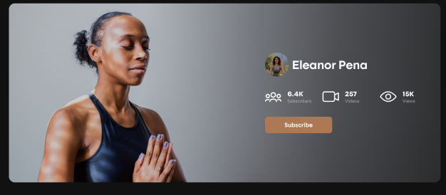
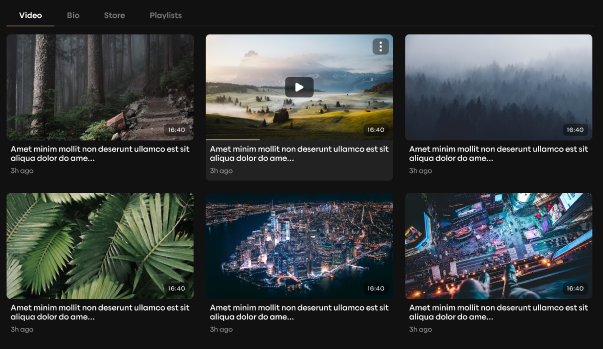
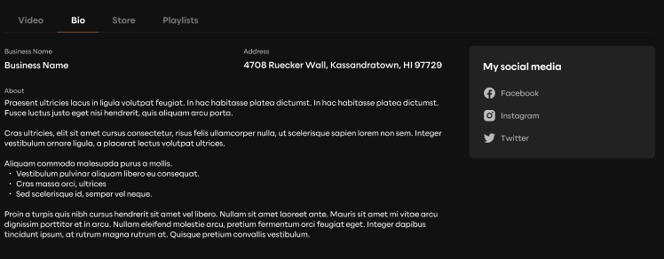
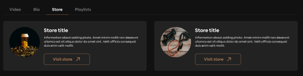
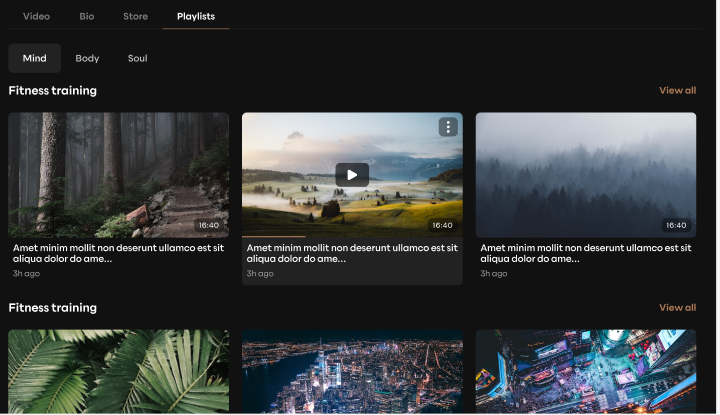
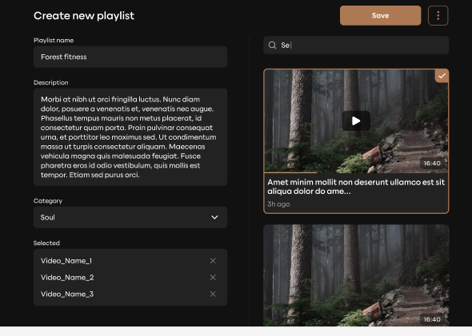
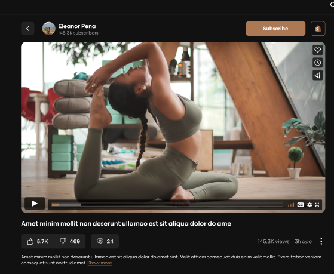

user with two roles (creator and user)

user has:

- user latest videos
- user view later videos
- user subsriptions (subsription on creators)
- notifications for new videos from subscribed creators
- search by videos

---

- all videos ( all creators videos )
- video categories (mind, body, soul) what is educational, fitness, spiritual ?
  

---

creator has:

- first name
- last name
- count of subscribers
- count of own added/uploaded videos
- count of videos viewed
  
- added videos
  
- bio (social media, address, business name, about)
  
- store
  
  can create a store (title, description, store link )
- playlists divided by categories(mind, body, soul) and inside categories by videos fitness, spiritual, etc
  
  can create playlists (name, description, category, videos)
  

---

each video has:

- title
- description
- url
- thumbnail
- likes and dislikes
- comments
- creator
- category
- date added
- views
- shopify link
- store?
  

---

profile (user and creator the same):

- avatar photo
- personal page cover photo (if creator)
- first name
- last name
- address
- business name (if creator)
- description
- vimeo account url
- facebook account url
- instagram account url
- twitter account url
- gender (male, female, none)
- date of birth
- llc
- email
